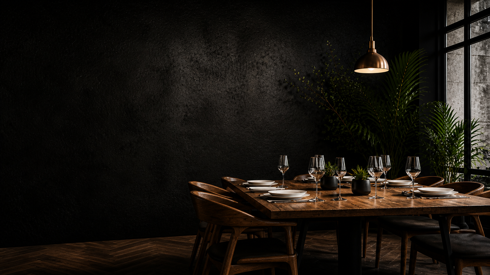
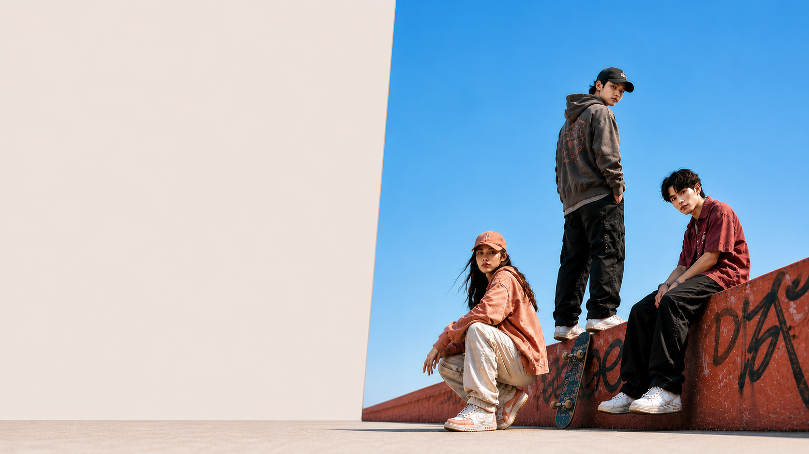

# UI Homepage Collection

A growing collection of homepage and landing page UI projects built with HTML and CSS.

Each folder contains one standalone webpage concept with its own source files, images, and project README.

## Projects

### [Mizu Matcha](./mizu)

A clean matcha e-commerce landing page with product, benefits, tutorial, journal, and signup sections.


### [Interior Design](./interior)

A modern interior design homepage focused on services, storytelling, and featured projects.


### [Velora Brew](./coffee)

A cafe and dining homepage with menu highlights, story sections, and location-focused imagery.



### [Void/13](./void13)

A fashion landing page concept with bold product visuals and streetwear-inspired layout.



### [Velora](./adanola)

A lifestyle apparel homepage with community, essentials, and product showcase sections.


## Structure

```text
UI-homepage-collection/
  README.md
  mizu/
  interior/
  coffee/
  void13/
  adanola/
```

## Notes

This repository is used as a daily UI practice and portfolio collection. New webpage concepts can be added as separate folders, then linked from this main README.
